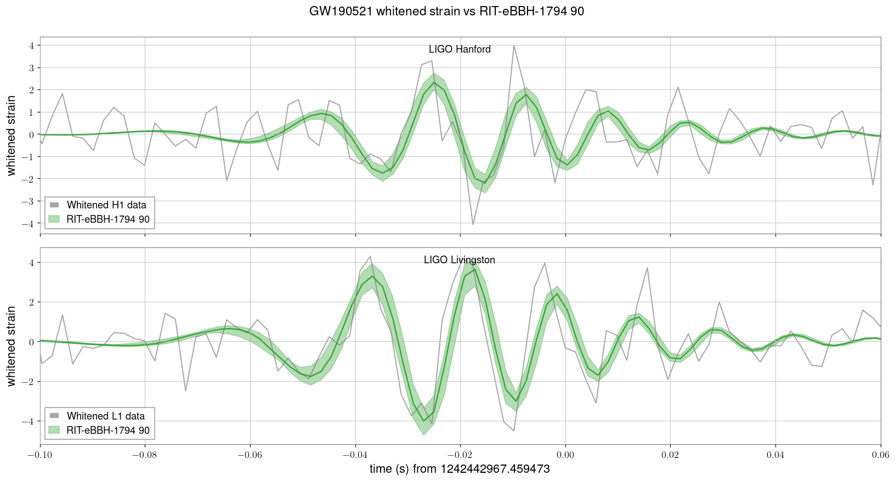

# nr : reconstruct a fixed NR simulation against an event

Reconstruct the whitened detector strain, with a 90% band, using a **single
fixed numerical-relativity simulation** as the template (example: GW190521 with
RIT-Five `eBBH-1794`).  This is the "does this NR waveform match the data, and
how well is the reconstruction constrained" task.



## Quick start

```bash
# edit config_gw190521.sh for your event / simulation, then:
bash reconstruct.sh config_gw190521.sh          # -> $OUT_PNG
```

`reconstruct.sh` runs ILE fair-draw jobs until enough posterior samples
accumulate, then builds the band.  To only (re)make the plot from samples you
already have:

```bash
make plot-only CONFIG=config_gw190521.sh
```

## What each file does

| file | role |
|---|---|
| `config_gw190521.sh`        | event + simulation + data/PSD settings |
| `run_extrinsic_fairdraw.sh` | one ILE extrinsic job (correct flags) → compact `.npz` |
| `reconstruct.sh`            | loop runs until `TARGET_SAMPLES`, then reconstruct |
| `Makefile`                  | `make gw190521`, `make plot-only CONFIG=...`, `make clean` |

Shared tools live one level up: `../reconstruct_strain.py`,
`../extract_ile_samples.py`, `../make_reconstruct_subfile.sh`.

## Required ILE flags (already set in run_extrinsic_fairdraw.sh)

```
--time-marginalization --fairdraw-extrinsic-output --resample-time-marginalization
--sampler-method adaptive_cartesian_gpu --no-adapt-after-first
--nr-lookup --nr-group <GROUP> --nr-param <ExtrapStrain_...h5> --nr-use-provided-strain
--d-min <Mpc> --d-max <Mpc>      # bracket the distance posterior
```

`--fairdraw-extrinsic-output --resample-time-marginalization` are **required**:
they give each sample its own coalescence time so the band coheres with no
alignment (see ../README.md).  `--no-adapt-after-first` keeps the sampler stable
so the fair-draw yield does not collapse.  Set `--d-min/--d-max` to bracket the
distance posterior.

## Notes specific to NR

* The NR strain scales with **total mass**; component masses in the samples set
  M and the simulation fixes the mass ratio / spins / eccentricity.  With a
  single-point intrinsic grid, `--intrinsic` is a no-op; for a mass curve it
  weights the total mass with uniform placement.
* The fair-draw yield per ILE job is stochastic (often tens of samples for a
  high-SNR event), so `reconstruct.sh` **pools several runs** until
  `TARGET_SAMPLES`.  Independent runs are entropy-seeded and pool correctly.
* NR data files may live in git-annex; `git annex get` the `ExtrapStrain_*.h5`
  you name first.  Do not set `RIFT_LOWLATENCY=1`.
* On a shared submit node, several concurrent ILE jobs can exhaust the per-user
  thread cap (`pthread_create ... EAGAIN`); `reconstruct.sh` runs them
  sequentially.  On a cluster, submit under condor instead (see ../README.md and
  `../make_reconstruct_subfile.sh`).

## Reference figure

`GW190521_reconstruction_example.png` was produced with the pooled fair-draw
samples from this recipe (57 waveforms, no alignment) and tracks the whitened
H1/L1 data through merger and ringdown.
