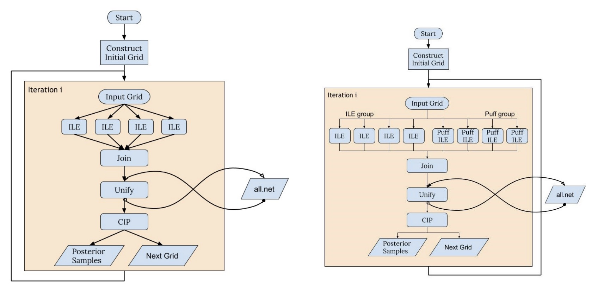

=============
RIFT Overview
=============

Basic Workflow
--------------
This figures shows an overview of the basic stages in a RIFT workflow, taken from `this paper <https://arxiv.org/pdf/2210.07912.pdf>`_.

1. Construct initial grid

Code for setting up pipeline (assuming the user has real or synthetic data already available) - i.e. this initial grid needs to be created is ``helper_LDG_events.py``. This script imports the data and the events, for injections. It then calculates parameter ranges and writes the arguments for ILE, CIP, puff, and covergence testing to text files to be used by a pipeline builder to create .sub that will be used by each iteration of RIFT to perform fitting.

This helper script is called by ``util_RIFT_pseudo_pipe.py`` and  ``pp_RIFT``
for both real event and injection recovery analysis.

2. ILE: Integrate Likelihood Extrinsic

The goal of the ILE step is to marginalize the likelihood of the data (real or synthetic, depending on your study) over the extrinisic parameters of the binary. The marginalized likelihoof is calculated for each combination of intrinsic parameter values via Monte Carlo. ILE generates point estimates for the marginalized likelihoods based on some set of input points.
   
3. CIP: Construct Intrinsic Posterior

CIP loads the training data created during the ILE step and fits it in particular coordinate systems well-suited to the given problem. Then, samples are drawn from the posterior using adaptive Monte Carlo to produce a sequence of weighted points.

The final set of points produced by CIP after an iteration are joined with results from previous iterations and fed back into the ILE stage. This process repeats iteratively, with the set of samples growing, until the paramater fits pass a convergence test.

Reference Papers
----------------

- Rapid and accurate parameter inference for coalescing, precessing compact binaries `[1805.10457] <https://arxiv.org/pdf/1805.10457.pdf>`_

- Expanding RIFT: Improving performance for GW parameter inference `[2210.07912] <https://arxiv.org/pdf/2210.07912.pdf>`_
